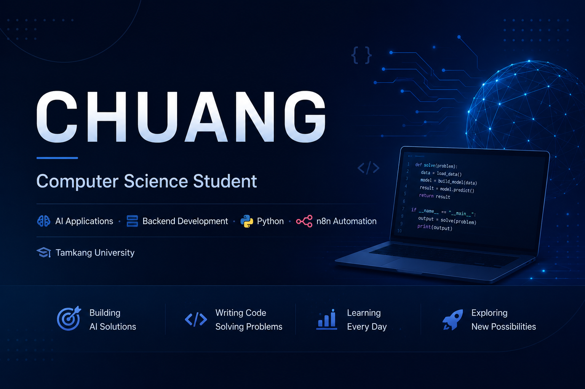

  

Hi 👋, I'm Chuang</h1>

<h3 align="center">
Computer Science Student | AI Applications | Software Development
</h3>

🎓 Tamkang University ・ 💻 Python & Java ・ 🤖 AI & Automation

---

## 🚀 About Me

- 🎓 Computer Science and Information Engineering student at Tamkang University
- 🤖 Interested in AI applications, software engineering, and backend development
- 💻 Building practical projects with Python, n8n, APIs, and databases
- 🌱 Currently improving my programming, system design, and software development skills
- 🌏 Planning to pursue a master's degree in the United States

---

## 🛠️ Tech Stack

### 💻 Programming Languages

  

- Python
- Java
- C++

### 🌐 Web Technologies

  

- HTML
- CSS

### 🤖 AI & Automation

- n8n Workflow Automation
- OpenAI API Integration
- LINE Messaging API
- Retrieval-Augmented Generation (RAG)
- Knowledge Graph
- JSON Data Processing

### 🗄️ Databases

- Neo4j
- Vector Database

### ⚙️ Development Tools

  

- Git and GitHub
- Visual Studio Code
- Jupyter Notebook

### 🖥️ System & IT

- Windows Installation
- Driver Installation
- BIOS Configuration
- System Recovery
- Computer Assembly
- System Image Deployment

---

## 🚀 Featured Project

### 🛍️ Conversational AI Shopping Assistant

A conversational shopping recommendation system that combines AI and workflow automation.

**Technologies:**

- Python
- n8n
- LINE Messaging API
- OpenAI API
- Knowledge Graph
- Vector Search

---

## 📊 GitHub Statistics

  

  

---

## 📫 Contact

- GitHub: [@0819jean](https://github.com/0819jean)
- mail: jean20050819@gmail.com

⭐ Thanks for visiting my GitHub profile!
